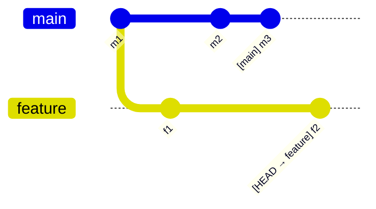
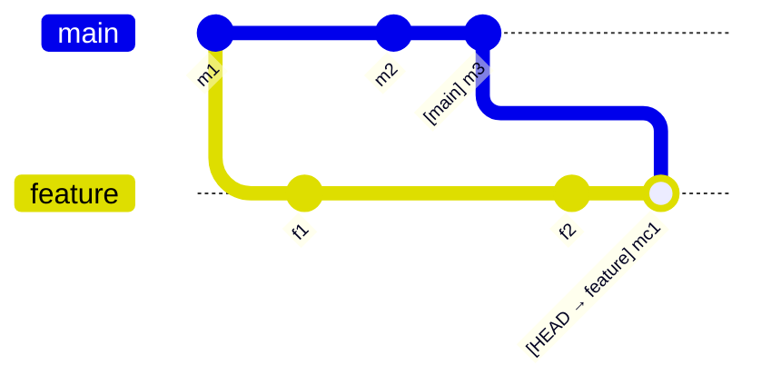
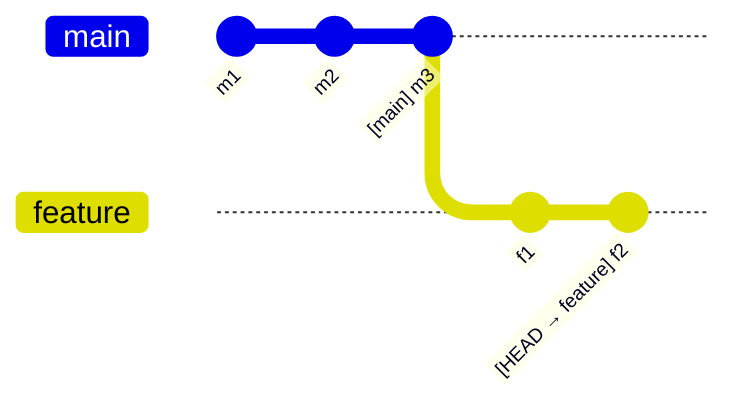
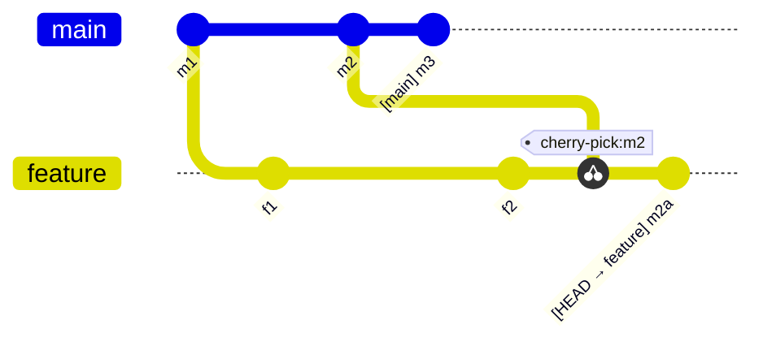

---
tags:
  - cs2103t/rcs
  - cs/software_eng
  - lang/sh
complete: false
prev: /labyrinth/notes/cs/cs2103t/SE_paradigms
next: /labyrinth/notes/cs/cs2103t/testing

---
### Summary
Git commands
```bash
# Initialize a new Git repository in the current directory
git init

# Clone an existing repository from a remote URL
git clone <repo_url>

# Show the current repository status:
# staged files, unstaged changes, untracked files, current branch
git status

# Add a specific file to the staging area
git add <file>

# Add all changed files to the staging area
git add .

# Commit staged changes with a message
git commit -m "<message>"

# Show commit history
git log

# Show a condensed one-line commit history
git log --oneline

# Show differences between working directory and last commit
git diff

# Show differences between staged changes and last commit
git diff --staged

# Create a new branch
git branch <branch>

# List all local branches
git branch

# Switch to an existing branch (modern replacement for checkout)
git switch <branch>

# Create and switch to a new branch
git switch -c <branch>

# Merge a branch into the current branch
git merge <other_branch>

# Merge with a forced merge commit and custom message
git merge --no-ff <other_branch> -m "Merge feature-branch"

# Delete a local branch
git branch -d <branch>

# Restore a file to the last committed state
git restore <file>

# Unstage a file (remove from staging area)
git restore --staged <file>

# Restore a file from a specific commit
git restore --source=<commit> <file>

# Add a remote repository
git remote add <remote_name> <remote_url>

# List configured remotes
git remote -v

# Fetch changes from the remote without merging
git fetch

# Pull changes from remote and merge into current branch
git pull

# Pull changes using rebase instead of merge
git pull --rebase

# Push local commits to a remote branch
git push origin <branch>

# Push a new branch to the remote and set upstream
git push -u origin <branch>

# Create a tag (e.g., for a release)
git tag <tag>

# List tags
git tag

# Revert a commit by creating a new commit that undoes it
git revert <commit>

# Reset branch pointer to a previous commit (dangerous)
git reset --hard <commit>

# Temporarily save uncommitted changes
git stash

# Reapply stashed changes
git stash pop
```

gitignore rules
```bash
# Basic
log.txt        # Ignores all files named log.txt
logs/          # Ignores all directories named logs (and everything under it)
/secret.txt    # Ignores secret.txt relative ti the .gitignore file

# Wildcards
# `*` matches any number of characters, except `/` (i.e., for matching a string within a single directory level):
abc/*.tmp      # Ignores all .tmp files in any abc directory

# `**` matches any number of characters (including `/`)
**/foo.tmp    # Ignores all foo.tmp files in any directory, same as foo.tmp

# `?` matches a single character
config?.yml   # Ignores config1.yml, configA.yml, etc.

# `[abc]` matches a single character (a, b, or c)
file[123].txt # Ignores file1.txt, file2.txt, file3.txt

# Negation (order is important)
*.log         # Ignores all .log files
!impt.log     # Except impt.log
```

Branch names
```
feature/login-form - for new features 
bugfix/profile-photo - for fixing bugs
hotfix/payment-crash - for urgent production fixes
release/2.0 - for prepping a release
experiment/ai-chatbot - for experiments
```
### Concept
#### Revision control software(RCS)
- managing multiple versions of a piece of information
- track history and evolution
- recover from mistakes
- **Centralized RCS**: single remote repo shared by the team
- **Decentralized RCS**: multiple remotes/forks

Staging and snapshoting
- files and changes can be staged
- staged files can then be commited to a snapshot

```bash
git add <file> # stages any changes in the file

git commit -m "<message>" # commits staged changes to a snapshot

git log # prints the commit history
```
> use imperative tense when writing commit messages, ie. "Add", "Update" and "Fix", avoid "Adds", "Adding" or "Added"

Remote repo
- external host that stores a copy of the repo
- forking a remote repo is like creating your own copy

```bash
git remote add <remote_name> <remote_url> # add a remote to the local repo

git push -u <remote_name> <local_branch> # pushes the local branch to the remote, -u links the local branch to the remote branch
git push # once upstream is set

git push <remote> <local_branch_name>:<remote_branch_name> # push to a remote branch with different name
```
> usually local and remote branches have the same name, as its more convenient

Pull
- fetch: dowloading latest changes from the remote
- merge: incorporate fetched changes into the local branch
- pull = fetch + merge

```bash
git fetch <remote> # fetch changes from the remote without merging
git fetch # fetched from origin by default

git merge <remote>/<remote_branch> # merge the remote branch into the current branch

git pull <remote> <branch> # fetch changes from remote and merge into current branch

git switch -c <branch> <remote>/<branch> # make a local copy of a remote branch
```

Tags
- make commits easier to reference
- mark specific commits
- lightweight: just a ref that points to a commit
- annotated: stores metadate about the tag, ususally for releases and versioning

```bash
git tag <tag> # add a lightweight tag to the current commit

git tag # prints all tags in the local repo

git push <remote> <tag> # push a tag to the remote

git push --delete <remote> <tag> # delete a tag in the remote

git push <remote> --tags # push all local tags to the remote
```
> tags can act as a ref to a commit, replacing the hash

Travesing commits
```bash
git chechout <ref>
git checkout v1.0 # checks out the commit tagged `v1.0`
git checkout 0023cdd # checks out the commit with the hash `0023cdd`
git checkout HEAD~2 # checks out the commit 2 commits behind HEAD
```
> the `HEAD` (usually) refers to the most recent commit in the current branch

Reset
- rewrite the branch history
- moves the branch's ref to another commit
- soft: changes are preserved and staged
- mixed: changes are preserved but not staged
- hard: changes are dropped
> rewriting history can cause the local branch to diverge, the remote branch must be overwritten with a force push
```bash
git reset --soft <commit>

git reset --medium <commit>
git reset <commit> # medium is the default

git reset --hard <commit>

git push -f <remote> <branch>
```

Revert
- undo a commit without modifying the branch history
- creates a new commit that undoes the change

```bash
git revert <commit> # makes a new commit that undoes
```
> might lead to merge conflicts

Rebase
- reword, rearrange, delete and combine commits

```bash
git rebase -i <start_commit> # interactive rebase for all the commits after the start commit, not inclusive
```
> avoid rebasing branches that have been pushed

#### Branching
- develop a version in parallel
- a branch is just a ref to the most recent commit in that diverged timeline
- changing branches is just telling `HEAD` to point to another branch's ref, `HEAD` indicates the branch currently being worked on

```bash
git branch # prints all local branches
git branch -a # prints local and tracking branches

git branch <branch> # creates a local branch
git checkout <branch> # checks out to local branch's ref

git checkout -b <branch> # creates anc checks out

git switch <branch> # switch to another branch, more modern version of checkout

git branch -m <current_name> <new_name> # rename(move) a local branch

git branch -d <branch> # delete a local branch
git branch -D <branch> # force delete
git push origin --delete <branch> # delete a remote branch
```
> remember to switch back to the `master` branch before creating a new branch

Merge between branches
- merge changes between two branches
- check changes since merge base, point where the branch was created
- fast-forward: if no divergence, set the current branch's ref to the source branch, no merge commit
- squash: changes from the source branch are combined into a single commit

```bash
git merge <source_branch> # merge the local branch into the current branch

git merge --no-ff <source_branch> # prevent fast-forward merge, creates merge commit as usual

git merge --squash <source_branch> #squash merge
```

Resolving conflicts
- when diverging branches modify the same part of a file

Syncing
- bring changes from another branch into the parallel branch
- keep the branch in sync with `master` to prevent big merge conflicts

- merge: bring over all the changes

- rebase: moves the base of the branch to the tip of the other

- cherry-picking: bring over specific commits

#### Collaboration
Pull requests
- request owner to pull your changes to the repo
- if accepted owner will merge the changes into the repo
> *LGTM*

Workflows
- centralize: all changes done on the master branch
- forking: each member makes a fork of the main, making pull requests from the fork to main
- feature branch: each feature is done in a different branch on each local repo
- trunk based: main trunk branch where small changes are made through shortlived branches