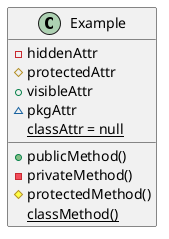
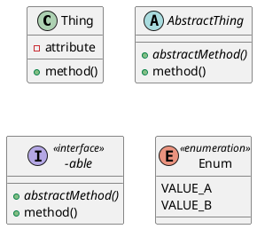
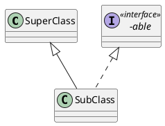
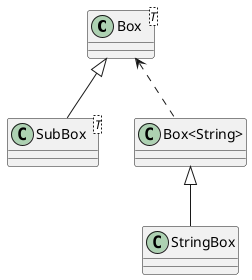
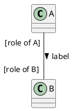
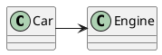
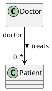
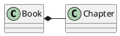
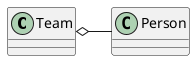
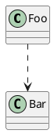

---
tags:
  - cs2103t/design
  - cs/software_eng
  - lang/uml
  - lang/java
complete: false
next: /labyrinth/notes/cs/cs2103t/uml_object_diagrams
prev: /labyrinth/notes/cs/cs2103t/javadoc

---
### Concept
#### Class diagrams
- captures **structure** of software design but not behaviour
- see [plantuml/class-diagram](https://plantuml.com/class-diagram)

Visibility
- `+`: public
- `-`: private
- `#`: protected
- `~`: package private
- underline: static attributes/methods
- `=`: indicate the default value


> there is no default visibility, unlike the [java access modifiers](/labyrinth/notes/cs/cs2103t/SE_paradigms#Access_modifiers) so leaving it blank means that the visibilty is *unspecified*, in general, absence means unspecified

Classifiers
- italics or with `{abstract}`: indicates an [abstract class](/labyrinth/notes/cs/cs2030s/java_class_abstraction#^b4c4eb)
- `<<interface>>`: indicates an [interface](/labyrinth/notes/cs/cs2030s/java_class_abstraction#^5e21e7)
- `<<enumerations>>`: indicates an [enum](/labyrinth/notes/cs/cs2103t/java_enumerations)



[Inheritence](/labyrinth/notes/cs/cs2030s/inheritance)
- points up towards the super class

- solid line with triangle: **extends**
- dashed line with triangle: **implements**


- involving [generics](/labyrinth/notes/cs/cs2030s/generics)


```java
class Box<T> {
}

class SubBox<T> extends Box<T> {
}

class StringBox extends Box<String> {
}
```

#### Associations
- connections between classes
- can show in the attributes compartment or with lines, but not both together

Roles
- closer to the boxes
- role of the object in the association

Labels
- can have arrow to indicate direction
- meaning of the association



Navigability
- can b e uni- or bidirectional
- arrow indicates direction of reference (not in plantuml)
- A -> B, A has a reference to B


```java
class Car {
	Engine engine;
}

class Engine
```

Multiplicity
- `0..x`: optional, 0 to x objects
- `x`: compulsory, must h ave x objects
- `*`: can have any number of objects
- `x..y`: x to y objects inclusive



Composition
- strong *whole-part* relationship
- composition =>
	1. if the whole is destroyed, parts are destroyed also
	2. cannot be cyclical links
- ie. folders composed of subfolders, email composed of subject


> depends on context also, chapters can exist outside of books if we are just gathering info about chapters

Aggregation
- *container-contained* relationship
- weaker than composition
- part can exist without the whole



Dependencies
- one class requires another for a short term interaction


```java
class Foo {
	// depends on Bar termporarily
	int calculate(Bar bar) {
			return bar.getValue();
	}
}

class Bar {
	int value;

	int getValue() {
			return value;
	}
}
```
> don't include the dependency if an association already implies it

Association class
- stores information about the association
- not possible in plantuml

![[association_class.png|300]]
