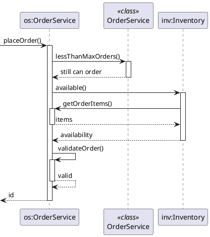
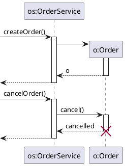
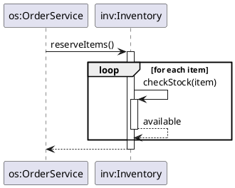
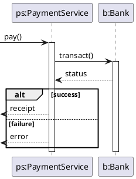
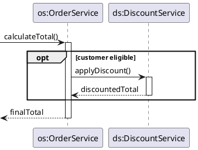
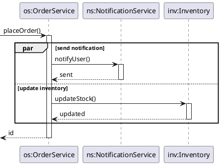
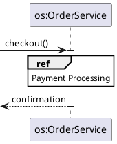

---
tags:
  - cs2103t/design
  - cs/software_eng
  - lang/uml
complete: false
prev: /labyrinth/notes/cs/cs2103t/java_assertions
next: /labyrinth/notes/cs/cs2103t/architecture_diagrams

---
### Concept
#### Sequence diagrams
- model interactions between entities in a system
- see [plantuml/sequence-diagram](https://plantuml.com/sequence-diagram)

Entities
- actors and components involved in the interaction
- lifeline: represents the life of the *instance*
> follow the naming convention for [object diagrams](/labyrinth/notes/cs/cs2103t/uml_object_diagrams) without underlining

Function calls
- function call: solid arrow
- return: optional dashed arrow
- activation bar: represents the method currently being executed

![[sequence_diagrams.png|400]]

- static methods: calls a method in the **class**
- self-call: calls another method in the **object**
- call back: back call to the previous object

Object creation & deletion
- constructor
- destructor: lifeline should terminate, not possible in plantuml

> in java, deletion means that the object is no longer refered to and ready for gabage collection
#### Frames
Loops
- repitition

Alternate paths
- no more than one alternative partition can be executed

Optional paths

Parallel paths
- execution done in [parallel](/labyrinth/notes/cs/cs2030s/parallelism)

Reference frames
- abstract away the behaviour to another diagram

