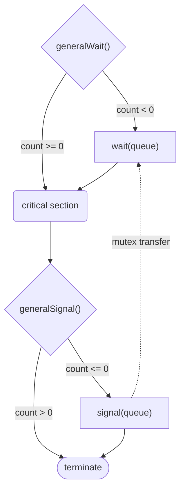

---
tags:
  - cs2106/chapter6
  - cs/parallel
  - lang/c
complete: false
prev: /labyrinth/notes/cs/cs2106/synchronization
next: /labyrinth/notes/cs/cs2106/synchronization_problems

---
### Summary
POSIX sempahore

| Syscall                          | Include         | Function                                                                |
| -------------------------------- | --------------- | ----------------------------------------------------------------------- |
| `sem_init(*sem, share, initial)` | `<semaphore.h>` | initializes an unnamed semaphore for use between threads or processes   |
| `sem_wait(*sem)`                 | `<semaphore.h>` | decrements (locks) the semaphore; blocks if the value is zero           |
| `sem_trywait(*sem)`              | `<semaphore.h>` | attempts to decrement the semaphore without blocking                    |
| `sem_post(*sem)`                 | `<semaphore.h>` | increments (unlocks) the semaphore, potentially waking a waiting thread |
| `sem_destroy(*sem)`              | `<semaphore.h>` | destroys an unnamed semaphore and frees associated resources            |
```c
sem_t mutex;
sem_init(&mutex,
         0, // 0 -> shared between threads, >0 -> shared between processes
         1); // initial value

sem_wait(&mutex);

sem_post(&mutex);
```
> compie with `-lrt`

POSIX syscalls for pthread mutex

| Syscall                   | Include       | Function                                               |
| ------------------------- | ------------- | ------------------------------------------------------ |
| `pthread_mutex_init()`    | `<pthread.h>` | initializes a mutex for use in thread synchronization  |
| `pthread_mutex_lock()`    | `<pthread.h>` | locks a mutex, blocking if the mutex is already locked |
| `pthread_mutex_trylock()` | `<pthread.h>` | attempts to lock a mutex without blocking              |
| `pthread_mutex_unlock()`  | `<pthread.h>` | unlocks a mutex so other threads can acquire it        |
| `pthread_mutex_destroy()` | `<pthread.h>` | destroys a mutex and releases associated resources     |
### Concept
#### Semaphore
- protected integer + [queue](/labyrinth/notes/cs/cs2040s/queue) of waiting processes
- has a way to block processes
- has a way to unblock **one or more** blocked processes
- general/counting semaphore - `S >= 0`
- binary semaphore - `S = 0 or 1`
> queue guarantees **bounded wait**

| `wait(S)`                                             | `signal(S)`                                              |
| ----------------------------------------------------- | -------------------------------------------------------- |
| `S--`<br>if `S < 0` : <br>  blocked process is stored | `S++`<br>if `S <= 0` :<br>  wakes up one blocked process |
| requesting                                            | yielding                                                 |
| blocking                                              | non-blocking                                             |

Invariant
$$
\verb|S|_{initial} \geq 0 \implies \verb|S|_{current}=\verb|S|_{initial}+\#\verb|signal(S)|-\#\verb|wait(S)|
$$
#### Mutex
- using a binary semaphore to create a critical section
- `S = 1` initially
- **mut**ual **ex**clusion

$$
\begin{align*}
&\text{Processes in CS:}&&\verb|N|_{CS} = \#\verb|wait(S)| - \#\verb|signal(S)| \\
&&&\verb|S|_{initial} = 1 \\
\\
&&&\begin{aligned}
\verb|S|_{current}&=\verb|S|_{initial}+\#\verb|signal(S)|-\#\verb|wait(S)| && \text{(Invariant)} \\
&=1+\#\verb|signal(S)|-\#\verb|wait(S)|
\end{aligned} \\
\\
&&&\verb|S|_{current}+\verb|N|_{CS} = 1\\
&&&\verb|S|_{current}\geq 0 \\
\\
&&&\therefore\verb|N|_{CS}\leq 1
\end{align*}
$$
- no deadlock

$$
\begin{align*}
&\text{Deadlock:}&&\verb|S|_{current}=0\text{ and }\verb|N|_{CS} = 0 \\
&&&\text{but }\verb|S|_{current}+\verb|N|_{CS} = 1 \\
\\
&&&\therefore\text{ contradiction}
\end{align*}
$$
### Application
Deadlock with multiple semaphores
```c
P = 1
Q = 1

// 1                               // 2
wait(P)                            wait(Q)
// 3, blocked by 2                 // 4, blocked by 1
wait(Q)                            wait(P)

// critical section                // critical section
// signal
```
> improper use can still lead to blocking

Semaphore behaviour using [pipes](/labyrinth/notes/cs/cs2106/pipes)
- implicit synchronization, only one thread can read from the buffer
- other threads lock until more data is written to the pipe

```c
typedef struct {
	int fd[2];
} pipelock;

void lock_init(pipelock *lock) {
	pipe(lock->fd); // create the pipe
	write(lock->fd[1], "a", 1); // one byte -> one process can acquire
}

void lock_acquire(pipelock *lock) {
	char c;
	read(lock->fd[0], &c, 1); // read one byte, block if none are available
}

void lock_release(pipelock *lock) {
	write(lock->fd[1], "a", 1);
}
```

Concurrent tasks
- identify dependencies, task can only happen after another task

```c
int x = 0;
S1 = 1;
S2 = 0;

// A
wait(S2); // stuck until C calls signal(S2)
wait(S1);
x = x * 2;
signal(S1);

// B
wait(S1);
x = x * x;
signal(S1);

// C
wait(S1);
x = x + 3;
signal(S2); // frees S2 for A
signal(S1);

// Possible orders:
// B -> C -> A       x = 6
// C -> A -> B       x = 36
// C -> B -> A       x = 18
```

Barrier
- wait until N tasks execute up to a certain point
- release all

```c
int count = 0;
mutex = 1;
waitQ = 0;

BARRIER(N) {
	wait(mutex); // safe increment count
	count++;
	signal(mutex);
	
	if (count == N)
		signal(waitQ); // Nth one unblocks the waiting queue
	
	wait(waitQ); // N-1 processes will block first
	signal(waitQ); // once the first is
}
```

General semaphore using binary semaphores
```c
int count = N; // N >= 0, number of processes allow to run concurrently
mutex = 1;
queue = 0;
```
- bad implementation
```c
void generalWait() {
	wait(mutex);
	count--;
	if (count < 0) { // only queue once N processes are allowed through
		signal(mutex); // do first so that its not blocked by wait
		wait(queue); // block
	} else {
		signal(mutex);
		// process is allowed to continue
	}
}

void generalSignal() {
	wait(mutex);
	count++;
	if (count <= 0) {
		signal(queue); // free up
	}
	signal(mutex); // prevents general wait from 
}

// consecutive generalSignal() can make signal(queue) increase beyond 1, if count is -ve
```
- fix
```c
void generalWait() {
	wait(mutex);
	count--;
	if (count < 0) { // give up mutex and block
		signal(mutex);
		wait(queue);
	}
	signal(mutex);
	// process is allowed to continue
}

void generalSignal() {
	wait(mutex);
	count++;
	if (count <= 0) {
		signal(queue);
		// mutex is freed by the second signal(mutex) in generalWait() of the unblocked process 
	} else {
		signal(mutex); // prevents general wait from
	}
}
```
> mutex owenership transfer ensures a direct HOTO from one process to the unblocked one
